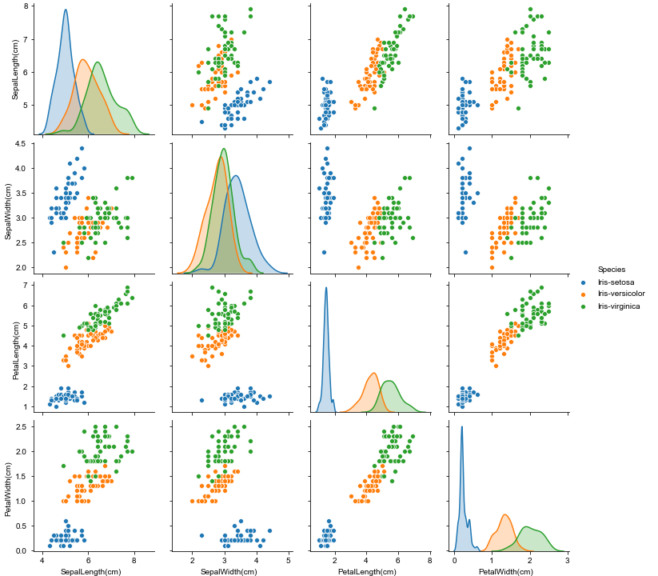
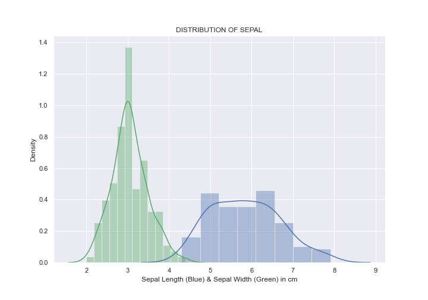
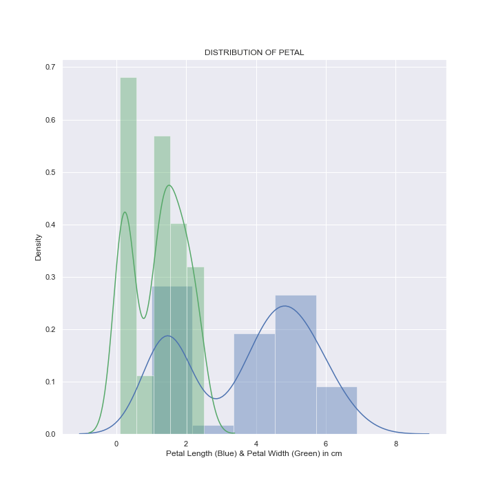
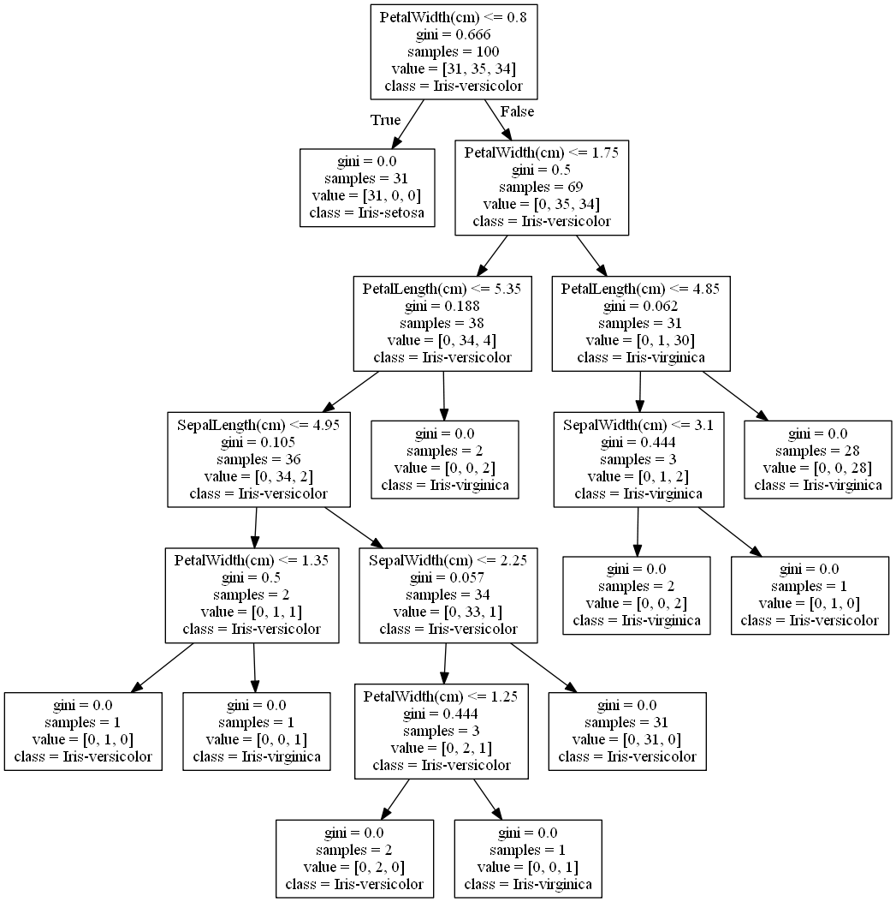

# Task 6 Prediction using Decision Tree Algorithm
### By: Claudia Jocelyn Sutanto

This task will predict the class of species while creating decison tree classifier and visualize the given data that must completed as an intern at [The Sparks Foundation](https://www.thesparksfoundationsingapore.org/). 

The Spark Foundation is an organisation with mission is to inspire students, help them innovate and let them integrate to build the next generation humankind with a vision of a world of enabled and connected little minds that build the future.

The data was provided by The from Spark Foundation given in this [link](https://bit.ly/3kXTdox).

## Visualisation
It shows the pairplot of sepal and petal in their length and width:

It shows the distribution of sepal:

It shows the distribution of petal:

## Decision Tree
The decison tree:

## About Internship
<b>Position</b> | Data Science and Business Analytics
<b>Duration</b> | One Month
<b>Type</b> | Online (Work from Home)